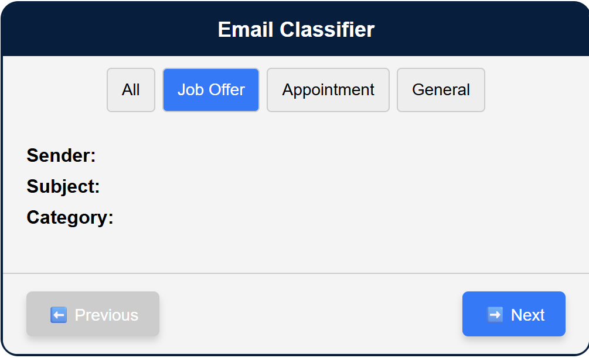

# Gmail Smart Email Classifier

This project is a full-stack application that connects to a user's Gmail account, automatically classifies incoming emails using Google Gemini AI, and displays them in a clean, interactive Angular interface. Users can browse, filter emails by category, and—when the email is an appointment—add it directly to their Google Calendar with a single click.



## 🧠 Features

- 🔐 Secure Gmail connection via OAuth2
- 📬 Email classification into:
  - Job Offer
  - Appointment
  - General
- 📅 Google Calendar integration for appointment emails
- 🎨 Simple, modern Angular frontend interface
- 🌐 Python backend serving email and calendar endpoints

## 🛠 Technologies Used

### Frontend
- Angular (standalone components)
- TypeScript
- SCSS / CSS

### Backend
- Python (FastAPI or Flask)
- Google APIs (Gmail, Calendar)
- Gemini AI model for classification
- OAuth2 authentication

## 🚀 Setup Instructions

### Frontend

```bash
cd frontend
npm install
ng serve
